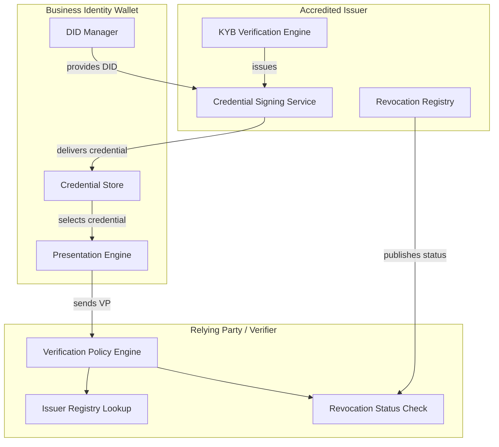
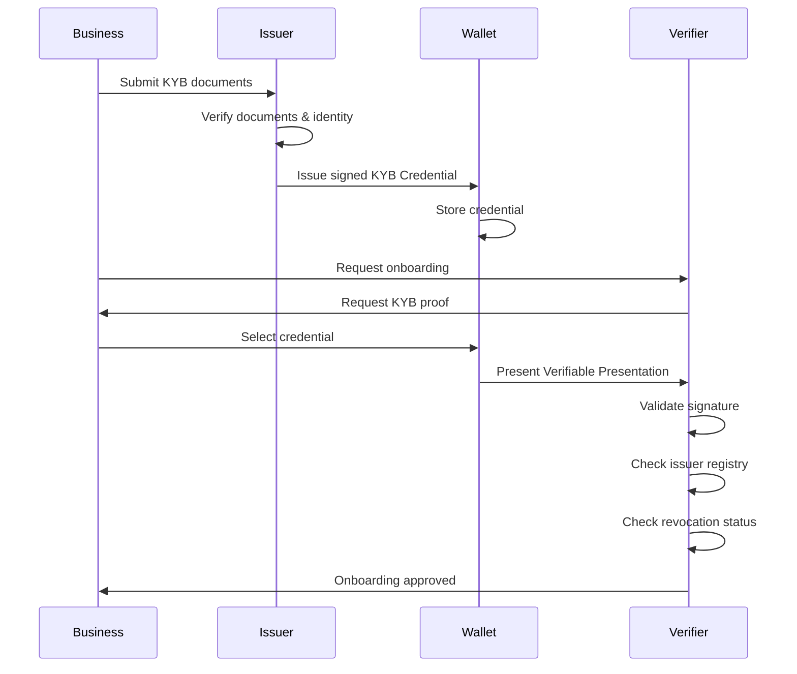
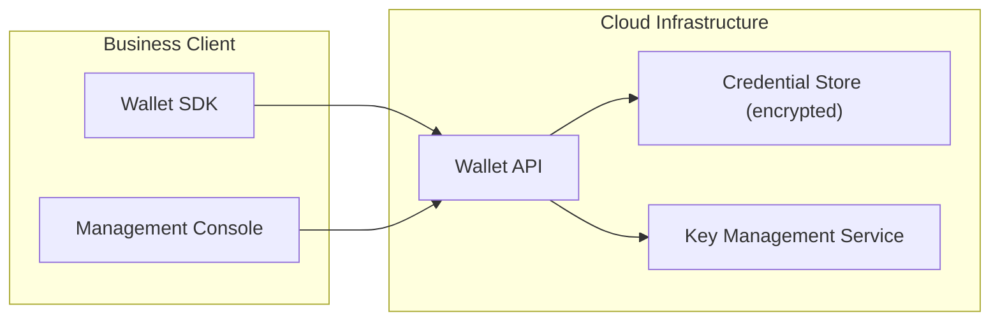

# KYB Identity Wallet — Architecture

## Overview

The KYB Identity Wallet is a reusable credential infrastructure that allows businesses to complete Know Your Business (KYB) verification once and share a cryptographically signed credential with any relying party — payout platforms, banks, marketplaces, or other financial service providers.

## Design Principles

1. **Verify Once, Use Everywhere** — Businesses should not repeat KYB for every new partner.
2. **Privacy by Design** — Minimal disclosure; share only what is needed.
3. **Interoperability** — Built on W3C Verifiable Credentials and Decentralized Identifiers.
4. **Tamper-Evident** — All credentials are digitally signed and independently verifiable.
5. **Revocable** — Issuers can revoke credentials if business status changes.

## System Components

## Credential Lifecycle

## Data Flow

### Issuance

1. A business submits incorporation documents, beneficial ownership info, and tax identifiers to an accredited issuer.
2. The issuer performs due diligence, AML/sanctions screening, and document verification.
3. Upon successful verification, the issuer creates a signed Verifiable Credential (VC) containing the KYB attestation.
4. The credential is delivered to the business's identity wallet.

### Presentation

1. A relying party (e.g., a payout platform) requests proof of KYB status.
2. The business selects the relevant credential from their wallet.
3. The wallet constructs a Verifiable Presentation (VP), signed by the business's DID.
4. The relying party validates the VP signature, checks the issuer against a trusted registry, and verifies revocation status.

### Revocation

1. If a business's status changes (e.g., dissolved, sanctioned), the issuer updates the revocation status list.
2. Verifiers check the status list during each verification to ensure the credential is still valid.

## Technology Stack

| Layer | Technology |
|---|---|
| Credential Format | W3C Verifiable Credentials v2.0 |
| Signature Suite | Ed25519Signature2020 / JsonWebSignature2020 |
| Identifier | Decentralized Identifiers (DIDs) — `did:web`, `did:key` |
| Revocation | StatusList2021 (bitstring-based) |
| Transport | HTTPS + DIDComm v2 |
| Schema | JSON Schema (Draft 2020-12) |

## Security Considerations

- **Key Management**: Private keys for credential signing MUST be stored in HSMs or secure enclaves.
- **Replay Protection**: Verifiable Presentations include a `challenge` and `domain` to prevent replay attacks.
- **Selective Disclosure**: Future versions will support BBS+ signatures for zero-knowledge selective disclosure.
- **Audit Trail**: All issuance and revocation events are logged with immutable audit records.

## Deployment Model

The wallet can be deployed as:
- **Cloud-hosted SaaS** — managed service with API access
- **Self-hosted** — deployed within the business's own infrastructure
- **Hybrid** — keys managed locally, credentials synced to cloud
