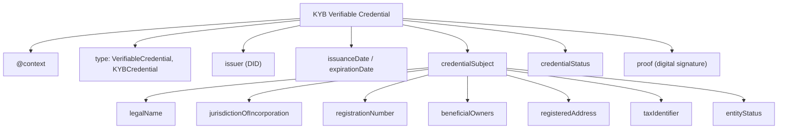

# KYB Credential Specification

## Overview

This document defines the structure and semantics of a KYB (Know Your Business) Verifiable Credential issued to businesses upon successful verification.

## Credential Format

The credential follows the [W3C Verifiable Credentials Data Model v2.0](https://www.w3.org/TR/vc-data-model-2.0/) and uses JSON-LD for semantic interoperability.

## Credential Structure

## Field Definitions

### Top-Level Fields

| Field | Type | Required | Description |
|---|---|---|---|
| `@context` | Array | Yes | JSON-LD contexts for semantic meaning |
| `id` | URI | Yes | Unique credential identifier |
| `type` | Array | Yes | Must include `VerifiableCredential` and `KYBCredential` |
| `issuer` | DID | Yes | DID of the accredited issuer |
| `issuanceDate` | DateTime | Yes | ISO 8601 timestamp of issuance |
| `expirationDate` | DateTime | Yes | ISO 8601 timestamp of expiration |
| `credentialSubject` | Object | Yes | The KYB attestation data |
| `credentialStatus` | Object | Yes | Revocation status reference |
| `proof` | Object | Yes | Digital signature |

### Credential Subject Fields

| Field | Type | Required | Description |
|---|---|---|---|
| `id` | DID | Yes | DID of the business (holder) |
| `legalName` | String | Yes | Registered legal name |
| `tradeName` | String | No | Trading or brand name |
| `jurisdictionOfIncorporation` | String (ISO 3166-1) | Yes | Country code of incorporation |
| `registrationNumber` | String | Yes | Official business registration number |
| `dateOfIncorporation` | Date | Yes | Date the entity was incorporated |
| `entityType` | String | Yes | e.g., "Corporation", "LLC", "Partnership" |
| `entityStatus` | String | Yes | e.g., "Active", "Dissolved" |
| `registeredAddress` | Object | Yes | Official registered address |
| `taxIdentifier` | String | No | Tax ID (EIN, VAT number, etc.) |
| `beneficialOwners` | Array | Yes | List of beneficial owners (>25% ownership) |
| `verificationLevel` | String | Yes | "basic", "standard", or "enhanced" |

### Beneficial Owner Object

| Field | Type | Required | Description |
|---|---|---|---|
| `name` | String | Yes | Full legal name |
| `dateOfBirth` | Date | Yes | Date of birth |
| `nationality` | String (ISO 3166-1) | Yes | Country code |
| `ownershipPercentage` | Number | Yes | Percentage of ownership |
| `pep` | Boolean | Yes | Politically Exposed Person flag |
| `sanctionsScreeningPassed` | Boolean | Yes | Sanctions check result |

### Registered Address Object

| Field | Type | Required | Description |
|---|---|---|---|
| `streetAddress` | String | Yes | Street address |
| `city` | String | Yes | City |
| `stateOrProvince` | String | No | State or province |
| `postalCode` | String | Yes | Postal/ZIP code |
| `country` | String (ISO 3166-1) | Yes | Country code |

## Verification Levels

| Level | Checks Performed |
|---|---|
| **Basic** | Document verification, registry lookup |
| **Standard** | Basic + beneficial ownership verification + sanctions screening |
| **Enhanced** | Standard + on-site verification + enhanced due diligence |

## Validity Period

- **Standard credentials**: Valid for 12 months from issuance.
- **Enhanced credentials**: Valid for 24 months from issuance.
- Credentials MUST be re-issued upon expiration.
- Credentials MAY be revoked at any time if the business's status changes.

## Schema Reference

The formal JSON Schema for this credential is defined in `schemas/kyb-credential.schema.json`. Example credentials are available in the `examples/` directory.
