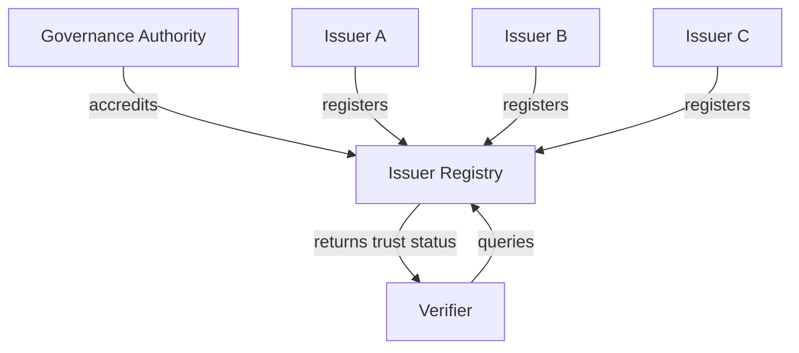
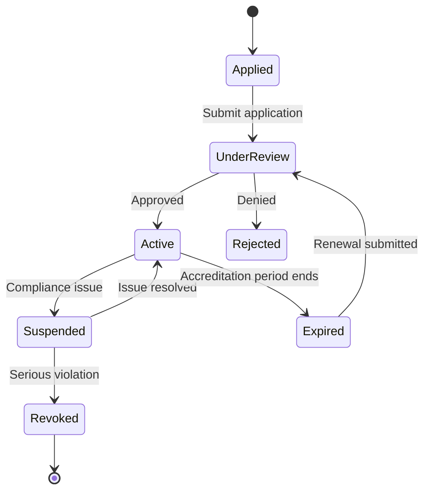

# Issuer Registry Specification

## Overview

The Issuer Registry is a shared, publicly accessible directory of accredited KYB credential issuers. Verifiers use this registry to determine whether a credential was issued by a trusted and authorized entity.

## Registry Architecture



## Registry Entry Schema

Each issuer entry contains the following fields:

```json
{
  "issuerId": "did:web:issuer-alpha.example",
  "legalName": "Alpha Verification Services",
  "jurisdiction": "US",
  "accreditationStatus": "active",
  "accreditedSince": "2024-01-15T00:00:00Z",
  "accreditationExpires": "2026-01-15T00:00:00Z",
  "credentialTypesAuthorized": ["KYBCredential"],
  "publicKeys": [
    {
      "id": "did:web:issuer-alpha.example#key-1",
      "type": "Ed25519VerificationKey2020",
      "publicKeyMultibase": "z6MkhaXgBZDvotDkL5257faiztiGiC2QtKLGpbnnEGta2doK"
    }
  ],
  "serviceEndpoints": {
    "credentialIssuance": "https://issuer-alpha.example/api/v1/issue",
    "revocationStatus": "https://issuer-alpha.example/api/v1/status"
  },
  "metadata": {
    "website": "https://issuer-alpha.example",
    "supportContact": "support@issuer-alpha.example"
  }
}
```

## Accreditation Lifecycle



## Governance

### Accreditation Requirements

To be listed in the registry, an issuer MUST:

1. Demonstrate capability to perform KYB verification per applicable regulations.
2. Maintain appropriate data protection certifications (e.g., SOC 2, ISO 27001).
3. Use approved cryptographic signature suites.
4. Implement credential revocation per the StatusList2021 specification.
5. Submit to periodic audits by the governance authority.

### Suspension and Revocation

An issuer's accreditation MAY be suspended or revoked if:

- They fail a compliance audit.
- They issue credentials without proper verification.
- Their cryptographic keys are compromised.
- They cease operations.

## API

### Query Issuer Status

```
GET /registry/issuers/{issuerId}
```

**Response:**

```json
{
  "issuerId": "did:web:issuer-alpha.example",
  "accreditationStatus": "active",
  "accreditedSince": "2024-01-15T00:00:00Z",
  "accreditationExpires": "2026-01-15T00:00:00Z"
}
```

### List All Active Issuers

```
GET /registry/issuers?status=active
```

### Verify Issuer Trust

```
POST /registry/verify-trust
```

**Request Body:**

```json
{
  "issuerId": "did:web:issuer-alpha.example",
  "credentialType": "KYBCredential"
}
```

**Response:**

```json
{
  "trusted": true,
  "accreditationStatus": "active",
  "authorizedForType": true
}
```

## Distribution

The registry is published as:

1. **REST API** — real-time queries for verifiers.
2. **Signed JSON document** — periodically published snapshot for offline verification.
3. **DID-linked resource** — resolvable via the governance authority's DID document.
