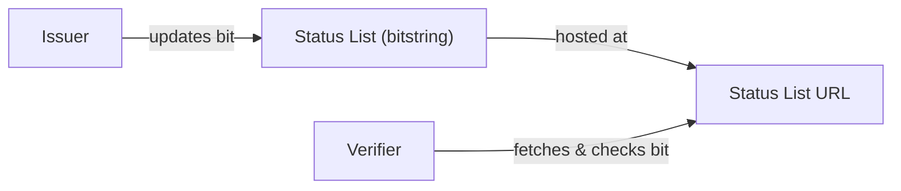
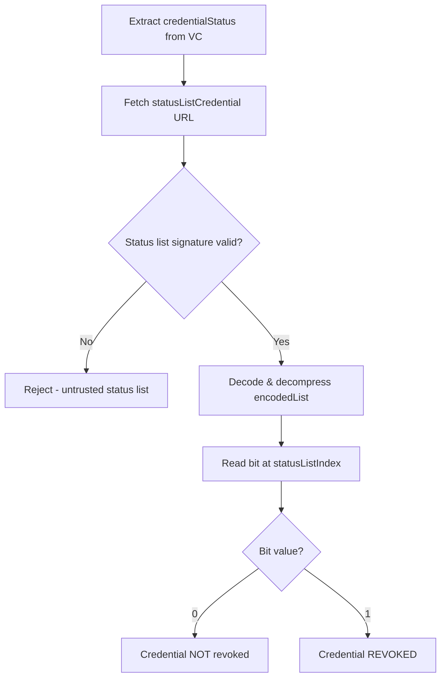

# Revocation Status List Specification

## Overview

This document specifies how KYB credential revocation is handled using the **StatusList2021** mechanism. Issuers publish a compressed bitstring where each bit position corresponds to a credential's revocation status.

## Mechanism



### How It Works

1. When issuing a credential, the issuer assigns it a unique `statusListIndex` (bit position).
2. The credential includes a `credentialStatus` field pointing to the status list URL and index.
3. To revoke a credential, the issuer sets the corresponding bit to `1`.
4. Verifiers fetch the status list and check the bit at the credential's index.

## Credential Status Field

Each credential includes a status reference:

```json
{
  "credentialStatus": {
    "id": "https://issuer-alpha.example/api/v1/status/1#42",
    "type": "StatusList2021Entry",
    "statusPurpose": "revocation",
    "statusListIndex": "42",
    "statusListCredential": "https://issuer-alpha.example/api/v1/status/1"
  }
}
```

## Status List Credential

The status list itself is published as a Verifiable Credential:

```json
{
  "@context": [
    "https://www.w3.org/2018/credentials/v1",
    "https://w3id.org/vc/status-list/2021/v1"
  ],
  "id": "https://issuer-alpha.example/api/v1/status/1",
  "type": ["VerifiableCredential", "StatusList2021Credential"],
  "issuer": "did:web:issuer-alpha.example",
  "issuanceDate": "2025-01-01T00:00:00Z",
  "credentialSubject": {
    "id": "https://issuer-alpha.example/api/v1/status/1#list",
    "type": "StatusList2021",
    "statusPurpose": "revocation",
    "encodedList": "H4sIAAAAAAAAA-3BMQEAAAABIKf..."
  },
  "proof": { }
}
```

## Verification Process



## Bitstring Encoding

1. Initialize a bitstring of minimum 16KB (131,072 bit positions).
2. Set bit `0` for all positions (not revoked).
3. To revoke credential at index `N`, set bit `N` to `1`.
4. GZIP compress the bitstring.
5. Base64-encode the compressed result into `encodedList`.

## Caching Policy

| Party | Cache Duration | Notes |
|---|---|---|
| Verifier | Max 5 minutes | Balance freshness vs. load |
| CDN | Max 1 minute | Short TTL for near-real-time |
| Issuer | N/A | Source of truth, no caching |

## Revocation Reasons

Issuers SHOULD maintain an internal log of revocation reasons, but these are NOT exposed in the status list (privacy preservation). Common reasons include:

- Business dissolved or deregistered
- Sanctions match identified post-issuance
- Fraudulent application detected
- Credential holder requested revocation
- Issuer key compromise (bulk revocation)
