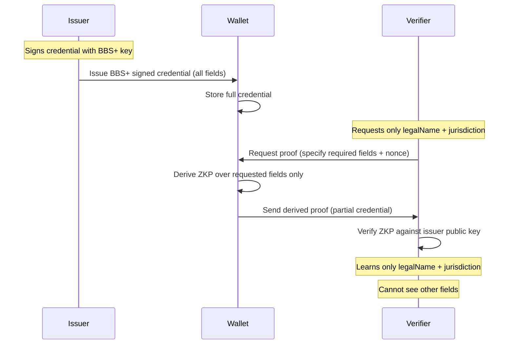
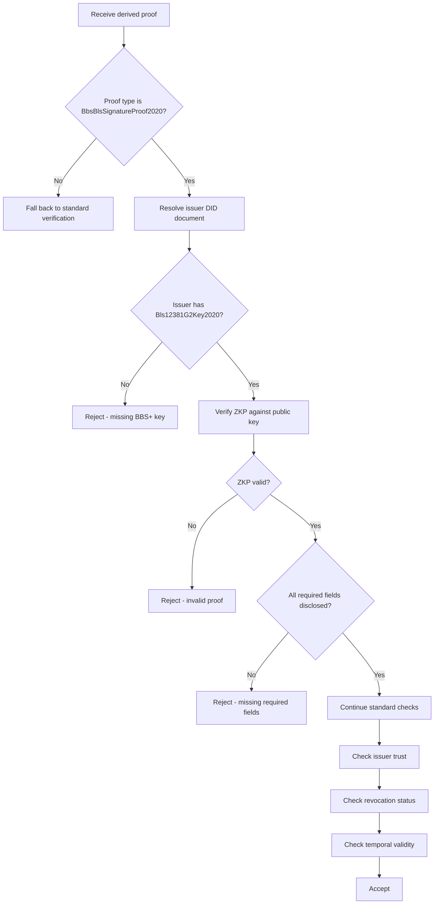

# Selective Disclosure Specification

## Overview

This document specifies the selective disclosure mechanism for KYB credentials using **BBS+ Signatures** and **zero-knowledge proofs (ZKPs)**. Selective disclosure allows a business to reveal only specific fields from a credential without exposing the entire document — preserving privacy while maintaining cryptographic verifiability.

## Motivation

In many onboarding scenarios, a relying party does not need every field in a KYB credential:

| Scenario | Fields Needed | Fields NOT Needed |
|---|---|---|
| Payout platform onboarding | legalName, jurisdiction, entityStatus | beneficialOwners, taxIdentifier |
| Marketplace seller verification | legalName, registrationNumber, entityType | registeredAddress, beneficialOwners |
| Banking compliance check | All fields | — |
| Partner due diligence | legalName, jurisdiction, verificationLevel | taxIdentifier, registeredAddress |

With standard signatures (e.g., Ed25519), the entire credential must be shared — it's all or nothing. BBS+ signatures solve this by allowing the holder to derive a proof over a subset of fields.

## How BBS+ Selective Disclosure Works



### Key Properties

1. **Unlinkability** — Multiple derived proofs from the same credential cannot be correlated by verifiers (each proof includes unique randomness).
2. **Non-transferability** — The holder binding prevents credential sharing between entities.
3. **Issuer-independent** — The holder creates derived proofs without contacting the issuer.
4. **Tamper-evident** — Any modification to disclosed fields invalidates the proof.

## Cryptographic Foundation

### BBS+ Signature Scheme

BBS+ operates on pairing-friendly elliptic curves and supports multi-message signing:

```
BBS+ Sign:
  Input:  Secret key (sk), messages [m1, m2, ..., mn]
  Output: Signature (A, e, s)

BBS+ Derive Proof:
  Input:  Public key (pk), signature (A, e, s), 
          all messages [m1..mn], disclosed indices [i, j, ...], nonce
  Output: Zero-knowledge proof (π) over disclosed messages only

BBS+ Verify Proof:
  Input:  Public key (pk), proof (π), 
          disclosed messages, disclosed indices, nonce
  Output: Boolean (valid / invalid)
```

### Supported Curve

| Parameter | Value |
|---|---|
| Curve | BLS12-381 |
| Signature Suite | `BbsBlsSignature2020` |
| Proof Suite | `BbsBlsSignatureProof2020` |
| Key Type | `Bls12381G2Key2020` |
| Hash | SHA-256 |

## Credential Issuance with BBS+

When a credential is issued with BBS+ support, each field in `credentialSubject` is treated as an individual message in the BBS+ multi-message signature.

### Field-to-Message Mapping

Each credential subject field is canonicalized and assigned a message index:

| Index | Field | Example Value |
|---|---|---|
| 0 | id | `did:web:acme-widgets.example` |
| 1 | legalName | `Acme Widgets International Ltd.` |
| 2 | tradeName | `Acme Widgets` |
| 3 | jurisdictionOfIncorporation | `US` |
| 4 | registrationNumber | `EX-2024-78901234` |
| 5 | dateOfIncorporation | `2019-06-15` |
| 6 | entityType | `Corporation` |
| 7 | entityStatus | `Active` |
| 8 | registeredAddress | `(serialized object)` |
| 9 | taxIdentifier | `XX-1234567` |
| 10 | beneficialOwners | `(serialized array)` |
| 11 | verificationLevel | `standard` |

### BBS+ Signed Credential Example

```json
{
  "@context": [
    "https://www.w3.org/2018/credentials/v1",
    "https://w3id.org/security/bbs/v1",
    "https://example.com/contexts/kyb/v1"
  ],
  "id": "urn:uuid:8b4f7c2a-1d3e-4a5b-9c6f-0e8d7a2b3c4d",
  "type": ["VerifiableCredential", "KYBCredential"],
  "issuer": "did:web:issuer-alpha.example",
  "issuanceDate": "2025-03-01T12:00:00Z",
  "expirationDate": "2026-03-01T12:00:00Z",
  "credentialSubject": {
    "id": "did:web:acme-widgets.example",
    "legalName": "Acme Widgets International Ltd.",
    "tradeName": "Acme Widgets",
    "jurisdictionOfIncorporation": "US",
    "registrationNumber": "EX-2024-78901234",
    "dateOfIncorporation": "2019-06-15",
    "entityType": "Corporation",
    "entityStatus": "Active",
    "registeredAddress": {
      "streetAddress": "742 Innovation Boulevard, Suite 400",
      "city": "Metropolis",
      "stateOrProvince": "NY",
      "postalCode": "10001",
      "country": "US"
    },
    "taxIdentifier": "XX-1234567",
    "beneficialOwners": [
      {
        "name": "Jane Doe",
        "dateOfBirth": "1985-04-12",
        "nationality": "US",
        "ownershipPercentage": 60,
        "pep": false,
        "sanctionsScreeningPassed": true
      }
    ],
    "verificationLevel": "standard"
  },
  "proof": {
    "type": "BbsBlsSignature2020",
    "created": "2025-03-01T12:00:00Z",
    "verificationMethod": "did:web:issuer-alpha.example#bbs-key-1",
    "proofPurpose": "assertionMethod",
    "proofValue": "kTTbA3pmDa6Qia/JkOnIXDLmoBz3vsi7L5t3DWySI/..."
  }
}
```

## Derived Proof (Selective Disclosure Presentation)

When a verifier only needs `legalName` and `jurisdictionOfIncorporation`, the wallet creates a derived proof:

```json
{
  "@context": [
    "https://www.w3.org/2018/credentials/v1",
    "https://w3id.org/security/bbs/v1",
    "https://example.com/contexts/kyb/v1"
  ],
  "id": "urn:uuid:8b4f7c2a-1d3e-4a5b-9c6f-0e8d7a2b3c4d",
  "type": ["VerifiableCredential", "KYBCredential"],
  "issuer": "did:web:issuer-alpha.example",
  "issuanceDate": "2025-03-01T12:00:00Z",
  "expirationDate": "2026-03-01T12:00:00Z",
  "credentialSubject": {
    "id": "did:web:acme-widgets.example",
    "legalName": "Acme Widgets International Ltd.",
    "jurisdictionOfIncorporation": "US"
  },
  "proof": {
    "type": "BbsBlsSignatureProof2020",
    "created": "2025-03-15T09:00:00Z",
    "verificationMethod": "did:web:issuer-alpha.example#bbs-key-1",
    "proofPurpose": "assertionMethod",
    "nonce": "G7h9bDkSL2xPq4mN8wR6tY",
    "proofValue": "ABkB/wbvtIWnMNpEKOiNsnXKfKqwfmayEfe3cXIxO0A2..."
  }
}
```

Note that `registrationNumber`, `taxIdentifier`, `beneficialOwners`, `registeredAddress`, and other fields are completely absent — the verifier has no way to learn their values.

## Verification Flow with Selective Disclosure



## Disclosure Policy

Verifiers specify which fields they require using a **disclosure request**:

```json
{
  "disclosureRequest": {
    "credentialType": "KYBCredential",
    "requiredDisclosures": [
      "legalName",
      "jurisdictionOfIncorporation",
      "entityStatus"
    ],
    "optionalDisclosures": [
      "entityType",
      "verificationLevel"
    ],
    "nonce": "G7h9bDkSL2xPq4mN8wR6tY",
    "purpose": "Marketplace seller onboarding"
  }
}
```

The wallet presents this to the business for consent before deriving and sending the proof.

## Predicate Proofs (Future Enhancement)

Beyond revealing individual fields, BBS+ can support **predicate proofs** — proving statements about hidden values without revealing them:

| Predicate | What It Proves | What Stays Hidden |
|---|---|---|
| `ownershipPercentage > 50` | A majority owner exists | Actual percentage, owner name |
| `dateOfIncorporation < 2020-01-01` | Business is at least 5 years old | Exact incorporation date |
| `beneficialOwners.length >= 1` | At least one UBO declared | Number and details of UBOs |

> **Note:** Predicate proofs require additional cryptographic primitives (e.g., Bulletproofs or range proofs composed with BBS+) and are planned for a future version.

## Issuer Key Management

Issuers that support selective disclosure MUST maintain both key types:

```json
{
  "id": "did:web:issuer-alpha.example",
  "verificationMethod": [
    {
      "id": "did:web:issuer-alpha.example#key-1",
      "type": "Ed25519VerificationKey2020",
      "publicKeyMultibase": "z6MkhaXgBZDvotDkL5257faiztiGiC2QtKLGpbnnEGta2doK"
    },
    {
      "id": "did:web:issuer-alpha.example#bbs-key-1",
      "type": "Bls12381G2Key2020",
      "publicKeyBase58": "25EEkQtcLKsEzQ6JTo9cg4W7NHpaurnDy3uxUAH6bCJA..."
    }
  ]
}
```

- `Ed25519` key: Used for standard (full-disclosure) credentials.
- `Bls12381G2` key: Used for BBS+ (selective-disclosure) credentials.

Issuers MAY issue the same credential with both signature types, stored as separate credentials in the wallet.

## Privacy Considerations

| Concern | Mitigation |
|---|---|
| Verifier collusion | Unlinkable proofs — each derived proof uses fresh randomness |
| Over-collection | Wallet UI shows exactly which fields will be disclosed; business must consent |
| Issuer tracking | Issuer is not contacted during presentation; no phone-home |
| Metadata leakage | Credential ID may be linkable; consider using blinded credential IDs |
| Replay attacks | Nonce + domain binding prevents proof reuse |

## Compatibility

| Feature | Ed25519 Credentials | BBS+ Credentials |
|---|---|---|
| Full disclosure | Yes | Yes |
| Selective disclosure | No | Yes |
| Predicate proofs | No | Future |
| Revocation (StatusList2021) | Yes | Yes |
| Issuer registry | Yes | Yes (extended key types) |
| Verification policy | Compatible | Extended with disclosure requests |

## References

- [BBS+ Signatures (IETF Draft)](https://www.ietf.org/archive/id/draft-irtf-cfrg-bbs-signatures-07.html)
- [W3C BBS Data Integrity Cryptosuite](https://www.w3.org/TR/vc-di-bbs/)
- [BLS12-381 Curve Specification](https://hackmd.io/@benjaminion/bls12-381)
- [W3C Verifiable Credentials Data Model v2.0](https://www.w3.org/TR/vc-data-model-2.0/)
