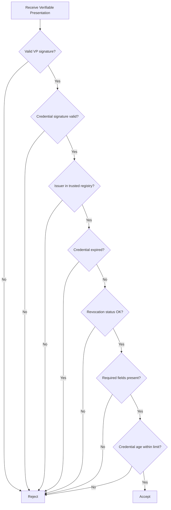

# Verification Policy Specification

## Purpose

This document defines the verification policy that relying parties (verifiers) MUST follow when accepting KYB credentials from business identity wallets.

## Policy Structure

A verification policy is a declarative document that specifies what a verifier requires to accept a KYB credential as valid.

```json
{
  "policyId": "pol-001",
  "version": "1.0",
  "name": "Standard KYB Acceptance Policy",
  "rules": {
    "trustedIssuers": ["did:web:issuer-alpha.example", "did:web:issuer-bravo.example"],
    "requiredFields": ["legalName", "jurisdictionOfIncorporation", "registrationNumber"],
    "maxCredentialAgeDays": 365,
    "revocationCheckRequired": true,
    "acceptedSignatureSuites": ["Ed25519Signature2020", "JsonWebSignature2020"]
  }
}
```

## Verification Steps



## Verification Rules

### 1. Presentation Validation

- The Verifiable Presentation MUST contain a valid `proof` signed by the presenting business's DID.
- The `challenge` in the proof MUST match the challenge issued by the verifier.
- The `domain` in the proof MUST match the verifier's domain.

### 2. Credential Signature Validation

- The embedded credential MUST have a valid cryptographic signature.
- The signature suite MUST be listed in the policy's `acceptedSignatureSuites`.

### 3. Issuer Trust

- The credential's `issuer` DID MUST appear in the verifier's trusted issuer list or in the shared Issuer Registry (see `issuer-registry-spec.md`).
- The issuer's DID document MUST be resolvable and contain the verification method referenced in the proof.

### 4. Temporal Validity

- The credential MUST NOT be expired (`expirationDate` not in the past).
- The credential age (`now - issuanceDate`) MUST NOT exceed `maxCredentialAgeDays` from the policy.

### 5. Revocation Check

- If `revocationCheckRequired` is `true`, the verifier MUST resolve the credential's `credentialStatus` and confirm it has not been revoked.
- See `revocation-status-list.md` for the revocation mechanism.

### 6. Required Fields

- All fields listed in `requiredFields` MUST be present in the credential's `credentialSubject`.
- Field values MUST be non-empty strings.

## Policy Levels

| Level | Description | Use Case |
|---|---|---|
| **Basic** | Signature + issuer trust only | Low-risk integrations |
| **Standard** | All checks including revocation | General onboarding |
| **Enhanced** | Standard + additional document requests | High-value transactions |

## Error Codes

| Code | Meaning |
|---|---|
| `VER_001` | Invalid presentation signature |
| `VER_002` | Invalid credential signature |
| `VER_003` | Untrusted issuer |
| `VER_004` | Credential expired |
| `VER_005` | Credential revoked |
| `VER_006` | Missing required fields |
| `VER_007` | Credential too old |
| `VER_008` | Unsupported signature suite |

## Audit Requirements

- Every verification attempt MUST be logged with: timestamp, credential ID, issuer DID, result (accept/reject), and rejection reason code.
- Logs MUST be retained for a minimum of 5 years for regulatory compliance.
